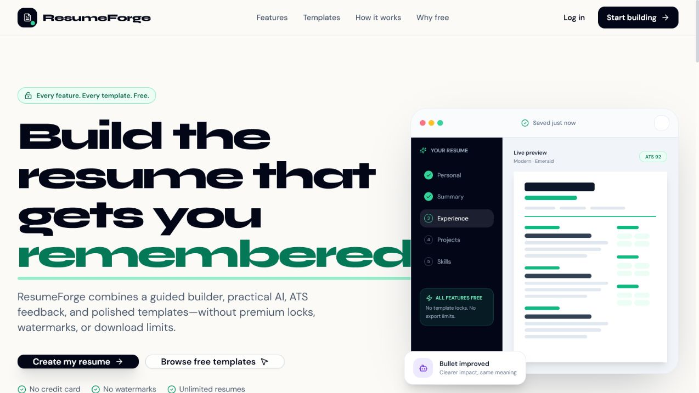
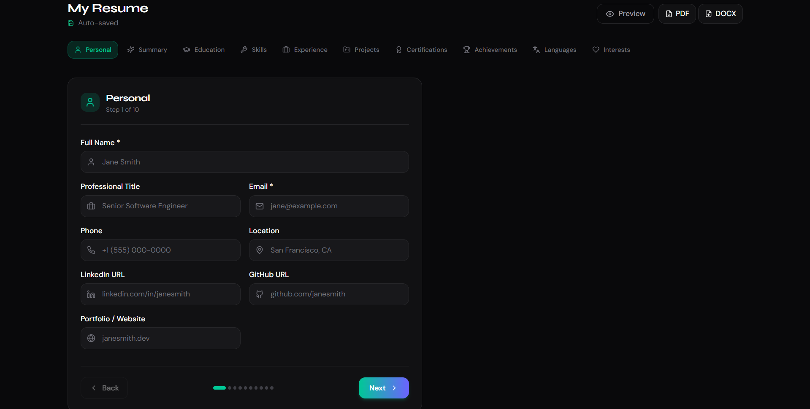
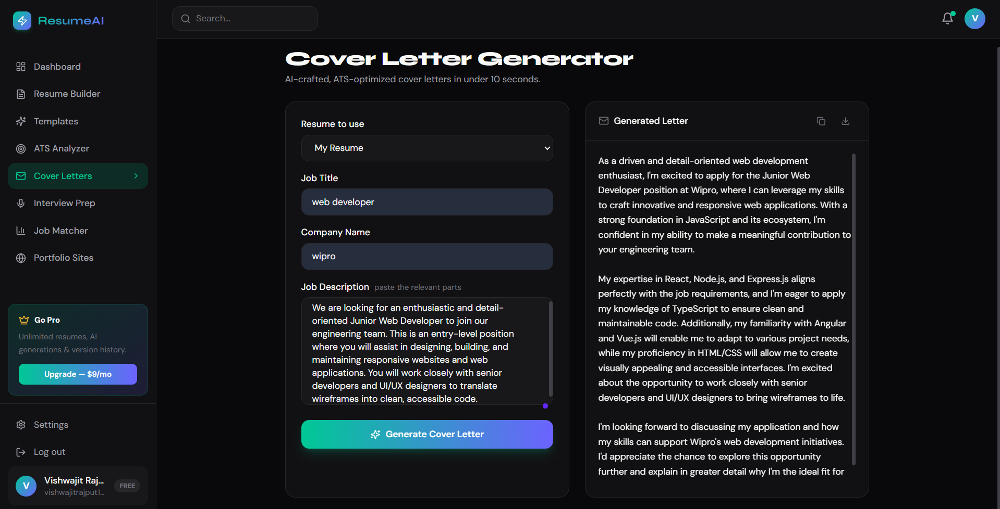
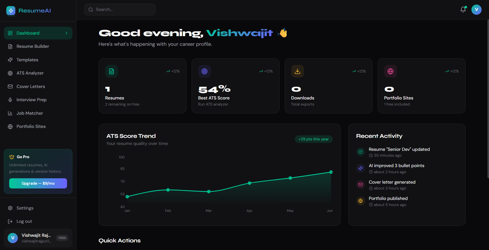
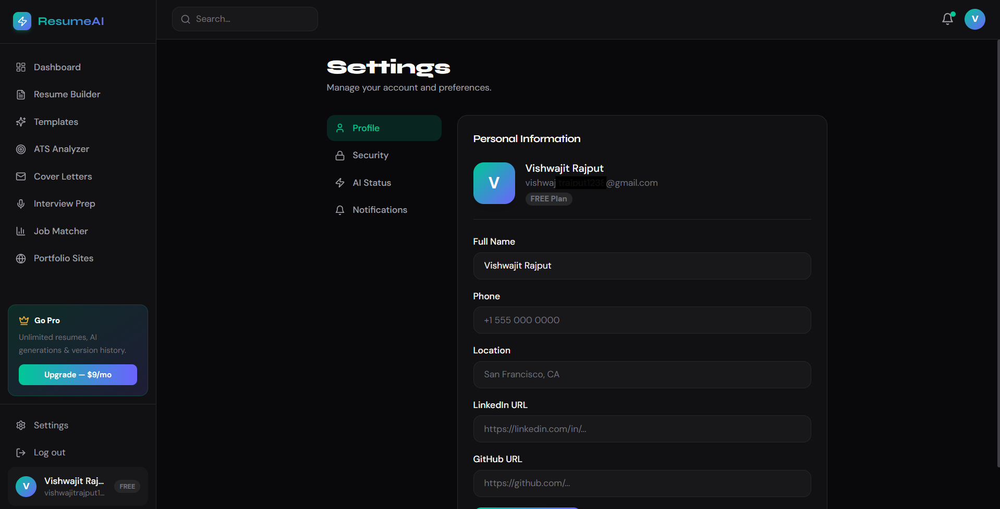

<div align="center">


# ⚡ ResumeForge

### *Build smarter. Score higher. Apply with confidence.*

> A complete AI-powered career toolkit for building ATS-friendly resumes, tailoring applications,
> generating cover letters, preparing for interviews, and publishing a professional portfolio.

<br/>

[](https://resume-forge-21-kohl.vercel.app/)

<br/>

<!-- ─── Frontend ─────────────────────────────────────────────────────────── -->
**Frontend**


<!-- ─── Backend ──────────────────────────────────────────────────────────── -->
**Backend**


<!-- ─── Database & Storage ───────────────────────────────────────────────── -->
**Database & Storage**


<!-- ─── AI & Integrations ────────────────────────────────────────────────── -->
**AI & Integrations**


<!-- ─── DevOps ───────────────────────────────────────────────────────────── -->
**Deployment**


</div>

<br/>

---

## 🚀 Live Demo

<div align="center">

### [**https://resume-forge-21-kohl.vercel.app**](https://resume-forge-21-kohl.vercel.app/)



*Create a free account or continue with Google to explore the complete career toolkit.*

</div>

<br/>

| Service | URL |
|:---|:---|
| 🌐 **Frontend** | [resume-forge-21-kohl.vercel.app](https://resume-forge-21-kohl.vercel.app/) |
| ⚙️ **Backend API** | [resume-forge-backend-21.onrender.com](https://resume-forge-backend-21.onrender.com/) |
| 💚 **Health Check** | [resume-forge-backend-21.onrender.com/health](https://resume-forge-backend-21.onrender.com/health) |

> No demo credentials are published. Sign up with email or use Google authentication; the app is currently free to use, subject to hosting and AI-provider quotas.

---

## 📌 Problem Statement

Job seekers often assemble their application workflow from disconnected tools that do not share context:

| Stage | Common Problem |
|:---|:---|
| 📝 Resume writing | Blank-page friction and weak, generic bullet points |
| 🎯 ATS optimization | No clear score, keyword guidance, or formatting feedback |
| 💼 Job tailoring | Manual comparison between every resume and job description |
| ✉️ Cover letters | Repetitive writing that is difficult to personalize at scale |
| 🎤 Interview preparation | Generic questions that ignore the candidate's role and skill level |
| 🌐 Professional presence | Resume data must be recreated again for a portfolio |
| 📤 Export | Watermarks, paid downloads, or inconsistent PDF/DOCX formatting |

**The consequence:** candidates lose time switching tools, submit less targeted applications, and receive little practical feedback before applying.

---

## 📸 Screenshots

<div align="center">

| | |
|:---:|:---:|
|  |  |
| **Guided 10-Step Resume Builder** | **Seven-Dimension ATS Analysis** |
|  |  |
| **AI Cover Letter Generator** | **Role-Specific Interview Preparation** |
|  |  |
| **Resume-to-Job Match Engine** | **Public Portfolio Publishing** |
|  |  |
| **Career Progress Dashboard** | **Profile, Security & AI Settings** |

</div>

---

## 💡 Solution

ResumeForge is a **unified AI career workspace** that keeps resume data, ATS feedback, job matching, cover letters, interview preparation, export, and portfolio publishing in one account.

The guided builder stores structured career data instead of locking content into a document. That same data can be improved with Groq or Gemini, scored by the built-in ATS engine, compared with a job description, exported to PDF or DOCX, and transformed into a public portfolio.

**The core advantage** is one reusable career profile powering the entire application workflow—from the first resume draft to the final interview.

---

## 🛠️ Tech Stack

### 🖥️ Frontend

| Technology | Version | Purpose |
|:---|:---:|:---|
|  **Next.js** | 15.5.20 | App Router, server rendering, routing, metadata, and production build |
|  **React** | 19.2.7 | Component-driven user interface |
|  **TypeScript** | 5.9.3 | Type-safe application development |
|  **Tailwind CSS** | 3.4.19 | Responsive utility-first styling |
| **TanStack Query** | 5.101.2 | Server-state fetching, caching, and invalidation |
| **Zustand** | 5.0.14 | Lightweight client state and persisted authentication |
| **React Hook Form + Zod** | 7.53 / 3.25 | Forms, validation, and typed input schemas |
| **Framer Motion** | 11.18.2 | Page and interface animations |
| **Recharts** | 2.15.4 | Dashboard and score visualizations |
| **Radix UI + Lucide** | — | Accessible interface primitives and icons |
| **html2canvas + jsPDF + docx** | — | Browser-side preview and document export tooling |

### ⚙️ Backend

| Technology | Version | Purpose |
|:---|:---:|:---|
|  **Node.js** | 20+ | Server runtime |
|  **Express** | 4.22.2 | REST API across ten route modules |
|  **TypeScript** | 5.9.3 | Typed backend services and API contracts |
| **Mongoose** | 8.24.1 | MongoDB models, validation, and indexes |
| **jsonwebtoken + bcryptjs** | 9.0 / 2.4 | Access/refresh tokens and password hashing |
| **Google Auth Library** | 10.9 | Google ID-token verification |
| **Puppeteer + docx** | 21.11 / 8.5 | Protected server-side PDF and DOCX export endpoint |
| **Nodemailer** | 6.9 | Password-reset email delivery |
| **Winston + Morgan** | — | Structured logs and HTTP request logging |
| **Helmet + CORS + rate limiting** | — | Security headers, origin control, and abuse protection |

### 🗄️ Database & Storage

| Technology | Purpose |
|:---|:---|
|  **MongoDB Atlas** | Users, refresh-token hashes, resumes, latest ATS results, usage counts, and portfolio state |
| **Mongoose indexes** | User-scoped queries, status filtering, public portfolio lookup, and date sorting |
|  **Cloudinary** | Reserved optional configuration; no active upload workflow yet |

### 🤖 AI & Integrations

| Service | Configuration | Purpose |
|:---|:---|:---|
|  **Groq** | Fast + quality model slots | Summaries, experience bullets, projects, skills, cover letters, interview questions, job matching, and chat |
|  **Google Gemini** | Fast + quality model slots | Primary or fallback AI provider |
|  **Google Identity Services** | OAuth web client | Popup authentication with backend audience verification |
| **SMTP** | Any compatible provider | Secure password-reset links |

### ☁️ DevOps & Deployment

| Service | Purpose |
|:---|:---|
|  **Vercel** | Next.js frontend hosting and production deployments |
|  **Render** | Express API hosting |
|  **MongoDB Atlas** | Managed production database |
|  **GitHub** | Source control and deployment integration |

---

## ⚙️ Features

### 🔵 Resume Building & Management


- **Guided 10-step builder** — personal details, summary, education, skills, experience, projects, certifications, achievements, languages, and interests
- **Structured resume data** — each section stays editable and reusable
- **Autosave** — drafts persist locally, then valid resumes debounce-save to the API
- **Multiple resumes** — create targeted versions for different roles
- **Customization** — choose template, accent color, and font family
- **Saved record metadata** — draft, complete, and archived state plus an internal version number

### 🟢 Templates & Export

- **Seven polished templates** — selectable from the template workspace
- **Live preview** — review the resume before exporting
- **PDF export** — client-side A4 downloads using `html2canvas` and `jsPDF`
- **DOCX export** — client-side editable Microsoft Word documents
- **Protected server export route** — Puppeteer and backend `docx` provide an additional API path
- **No watermarks** — exports remain candidate-owned and presentation-ready

### 🟡 AI Career Tools

|  |  |
|:---:|:---:|
| **AI Cover Letter Generator** | **AI Interview Preparation** |

- **Professional summary improvement** — concise, standard, or detailed tone
- **Experience bullet rewriting** — stronger action language and measurable impact
- **Project description improvement** — clearer technical outcomes
- **Skill suggestions** — role/domain-aware skill discovery
- **Cover letters** — tailored to candidate, company, role, and job description
- **Interview preparation** — technical, behavioral, situational, and role-specific questions with sample answers
- **Provider fallback** — Groq, Gemini, or Groq-first fallback mode

### 🔴 ATS Analysis & Job Matching

|  |  |
|:---:|:---:|
| **Seven-Dimension ATS Analyzer** | **Resume-to-Job Match Engine** |

- **Weighted ATS score** — contact information, summary, experience, education, skills, projects, and formatting
- **Letter grade** — clear A–F feedback alongside a 0–100 score
- **Priority fixes** — the highest-impact improvements appear first
- **Strength detection** — highlights sections already performing well
- **Readability and formatting scores** — separate diagnostics for resume quality
- **Keyword coverage** — found terms, missing terms, and density feedback
- **Job match score** — compares resume content with any pasted job description
- **Gap analysis** — matched skills, missing skills, keyword gaps, and targeted AI recommendations

### 🟣 Portfolio Publishing


- **Generate from resume data** — reuse existing career information
- **Public slug route** — share a clean `/portfolio/[slug]` URL
- **Responsive presentation** — professional layout across desktop and mobile
- **Contact and project links** — surface email, GitHub, portfolio, and project destinations
- **Publish control** — keep resume records private until explicitly shared

### 🟠 Account, Security & Analytics

|  |  |
|:---:|:---:|
| **Career Dashboard** | **Account Settings** |

- **Email/password authentication** — hashed passwords and validated requests
- **Google sign-in** — popup OAuth with backend token verification
- **Rotating sessions** — short-lived access tokens plus hashed refresh tokens
- **Password reset** — time-limited reset links delivered through SMTP
- **Career dashboard** — resume count, best ATS score, saved-resume score overview, usage counters, and recent activity
- **Profile and preferences** — personal information, AI status, notifications, and security
- **Account deletion** — remove the user and associated saved resumes

### ⚪ Infrastructure & UX

- **Responsive light/dark interface** — optimized for public, authentication, dashboard, builder, settings, and admin pages
- **Accessible primitives** — keyboard-friendly Radix UI components
- **Loading and error boundaries** — clear failure states across the application
- **Backend status page** — visible API and provider readiness
- **CORS allowlist** — production frontend origins are explicitly controlled
- **Request protection** — Helmet, Mongo sanitization, HPP prevention, validation, and rate limiting
- **User-scoped data** — protected resources are queried by the authenticated user

---

## 🧩 System Architecture

```text
┌──────────────────────────────────────────────────────────────┐
│                    CLIENT · Web Browser                      │
│   Next.js 15 · React 19 · TanStack Query · Zustand · Zod    │
└────────────────────────────┬─────────────────────────────────┘
                             │ HTTPS / JSON
                             ▼
┌──────────────────────────────────────────────────────────────┐
│               API SERVER · Express + TypeScript              │
│                                                              │
│  /auth       /resumes       /ai          /ats                │
│  /portfolios /cover-letters /interview   /job-match          │
│  /export     /admin                                        │
│                                                              │
│  Auth middleware · validation · rate limits · CORS · logs    │
└──────┬───────────────┬──────────────┬──────────────┬─────────┘
       │               │              │              │
       ▼               ▼              ▼              ▼
 MongoDB Atlas     Groq / Gemini   Google OAuth   SMTP Email
 users + resumes   AI generation   ID-token auth  reset links
       │
       ▼
 PDF / DOCX export services
 Puppeteer · docx

Frontend: Vercel                         Backend: Render
```

### Data Flow — Resume Creation & Optimization

```text
Candidate enters structured career information
                    │
                    ▼
┌───────────────────────────────────────────────┐
│            Guided 10-Step Builder             │
│  personal · summary · education · skills      │
│  experience · projects · certifications       │
│  achievements · languages · interests         │
└──────────────────────┬────────────────────────┘
                       │ autosave via REST
                       ▼
                 MongoDB Resume
                       │
          ┌────────────┼───────────────┐
          │            │               │
          ▼            ▼               ▼
    AI improvement  ATS engine    Job matcher
    Groq / Gemini   7 dimensions  resume vs JD
          │            │               │
          └────────────┴───────────────┘
                       │
                       ▼
            Preview · PDF · DOCX
                       │
                       ▼
               Public portfolio
```

---

## 📂 Project Structure

```text
Resume_Forge/
├── assets/
│   └── screenshots/                 # README product screenshots
├── frontend/                        # Next.js 15 application (Vercel)
│   ├── app/
│   │   ├── page.tsx                 # Marketing landing page
│   │   ├── auth/                    # Login, signup, and password reset
│   │   ├── dashboard/               # Career overview and activity
│   │   ├── resume/
│   │   │   ├── builder/             # Guided resume editor
│   │   │   └── templates/           # Template selection
│   │   ├── ats/                     # ATS scoring interface
│   │   ├── cover-letter/            # AI cover-letter generator
│   │   ├── interview-prep/          # AI interview questions
│   │   ├── job-match/               # Job-description comparison
│   │   ├── portfolio/               # Portfolio editor + public route
│   │   ├── settings/                # Profile and security settings
│   │   ├── backend-status/          # API readiness view
│   │   └── admin/                   # Administrative dashboard
│   ├── components/
│   │   ├── auth/                    # Auth guards and Google button
│   │   ├── layout/                  # Sidebar and shared app shell
│   │   ├── resume/                  # Builder, preview, and templates
│   │   └── ui/                      # Reusable UI primitives
│   ├── lib/                         # API client and utilities
│   ├── store/                       # Zustand stores
│   └── public/                      # Social preview assets
│
├── backend/                         # Express API (Render)
│   └── src/
│       ├── index.ts                 # Server entry point and middleware
│       ├── routes/
│       │   ├── auth.ts
│       │   ├── resume.ts
│       │   ├── ai.ts
│       │   ├── ats.ts
│       │   ├── portfolio.ts
│       │   ├── cover-letter.ts
│       │   ├── interview.ts
│       │   ├── job-match.ts
│       │   ├── export.ts
│       │   └── admin.ts
│       ├── models/
│       │   ├── User.ts
│       │   └── Resume.ts
│       ├── services/
│       │   ├── ai-provider.ts
│       │   ├── ats-engine.ts
│       │   ├── export-service.ts
│       │   └── google-identity.ts
│       ├── middleware/
│       │   ├── auth.ts
│       │   └── usage.ts
│       └── tests/                    # Auth, validation, and API tests
│
├── env.example.txt                  # Backend + frontend env reference
└── README.md
```

---

## 🧪 Running Locally

### Prerequisites

| Tool | Minimum Version |
|:---|:---:|
| Node.js | 20.0.0 |
| npm | 10 recommended |
| MongoDB | Local instance or Atlas cluster |
| Groq or Gemini | At least one API key for AI features |
| Google Cloud | Optional web OAuth client for Google sign-in |

### Installation

```bash
# Clone the repository
git clone https://github.com/Jaisingh-21/Resume_Forge.git
cd Resume_Forge

# Install backend dependencies
cd backend
npm install

# Install frontend dependencies
cd ../frontend
npm install
```

### Configuration

```bash
# From the repository root
# Copy the backend values from env.example.txt into:
backend/.env

# Copy the NEXT_PUBLIC_* values from env.example.txt into:
frontend/.env.local
```

Use the same Google Web client ID for `GOOGLE_CLIENT_ID` and `NEXT_PUBLIC_GOOGLE_CLIENT_ID`. Add the frontend origin to that client's **Authorized JavaScript origins** in Google Cloud.

### Start

```bash
# Terminal 1 — API server → http://localhost:5000
cd backend
npm run dev

# Terminal 2 — Frontend → http://localhost:3000
cd frontend
npm run dev
```

### Quality Checks

```bash
# Frontend
cd frontend
npm run lint
npx tsc --noEmit
npm run build

# Backend
cd ../backend
npm run build
npm test
```

---

## 🔐 Environment Variables

### Backend — `backend/.env`

| Variable | Required | Description |
|:---|:---:|:---|
| `NODE_ENV` | — | `development`, `test`, or `production`; defaults are available |
| `PORT` | — | Express port; defaults to `5000` |
| `MONGODB_URI` | ✅ | Local MongoDB or Atlas connection string |
| `JWT_ACCESS_SECRET` | ✅ | Unique random secret of at least 32 characters |
| `JWT_REFRESH_SECRET` | ✅ | Separate random secret for refresh tokens |
| `JWT_ACCESS_EXPIRES` | — | Optional access-token lifetime override, for example `15m` |
| `JWT_REFRESH_EXPIRES` | — | Optional refresh-token lifetime override, for example `7d` |
| `FRONTEND_URL` | ✅ | Canonical frontend URL used in generated links |
| `ALLOWED_ORIGINS` | ✅ | Comma-separated exact CORS origins |
| `GOOGLE_CLIENT_ID` | ⚙️ | Google Web client ID for backend audience verification |
| `AI_PROVIDER` | — | `GROQ`, `GEMINI`, or `GROQ_FALLBACK`; a default is available |
| `GROQ_API_KEY` | ⚙️ | Required when Groq is enabled |
| `GROQ_MODEL` | ➕ | Optional fast Groq model override |
| `GROQ_QUALITY_MODEL` | ➕ | Higher-quality Groq model |
| `GEMINI_API_KEY` | ⚙️ | Required when Gemini is enabled |
| `GEMINI_MODEL` | ➕ | Optional fast Gemini model override |
| `GEMINI_QUALITY_MODEL` | ➕ | Higher-quality Gemini model |
| `EMAIL_HOST` | ⚙️ | SMTP hostname for password-reset email |
| `EMAIL_PORT` | ⚙️ | SMTP port, commonly `587` |
| `EMAIL_USER` | ⚙️ | SMTP username |
| `EMAIL_PASS` | ⚙️ | SMTP password or app password |
| `EMAIL_FROM` | ⚙️ | Sender name and address |
| `CLOUDINARY_CLOUD_NAME` | ➕ | Optional Cloudinary cloud name |
| `CLOUDINARY_API_KEY` | ➕ | Optional Cloudinary API key |
| `CLOUDINARY_API_SECRET` | ➕ | Optional Cloudinary API secret |

### Frontend — `frontend/.env.local`

| Variable | Required | Description |
|:---|:---:|:---|
| `NEXT_PUBLIC_API_URL` | ✅ | Backend API base URL ending in `/api` |
| `NEXT_PUBLIC_APP_URL` | ⚙️ | Production-recommended canonical frontend origin |
| `NEXT_PUBLIC_GOOGLE_CLIENT_ID` | ⚙️ | Same Google Web client ID used by the backend |
| `BACKEND_HEALTH_URL` | ➕ | Optional backend `/health` endpoint override |
| `NEXT_PUBLIC_AI_PROVIDER` | ➕ | Optional provider label shown in the interface |

> **Never commit real credentials.** Keep production secrets in Render and public build-time values in Vercel. Rotate any key that is accidentally exposed.

> With `GROQ_FALLBACK`, Groq is attempted first and Gemini can provide a fallback when both providers are configured.

---

## 📸 User Journey

| Step | Action |
|:---:|:---|
| 1️⃣ **LAND** | Review the toolkit and create a free account |
| 2️⃣ **AUTHENTICATE** | Sign in with email/password or Google |
| 3️⃣ **CREATE** | Start a resume and choose a template |
| 4️⃣ **BUILD** | Complete the guided 10-step editor |
| 5️⃣ **IMPROVE** | Rewrite summaries, bullets, projects, and skills with AI |
| 6️⃣ **SCORE** | Run the seven-dimension ATS analyzer |
| 7️⃣ **MATCH** | Paste a job description and inspect gaps |
| 8️⃣ **TAILOR** | Apply the recommendations to a role-specific version |
| 9️⃣ **WRITE** | Generate a personalized cover letter |
| 🔟 **PRACTICE** | Create interview questions for the role and level |
| 1️⃣1️⃣ **EXPORT** | Preview and download PDF or DOCX |
| 1️⃣2️⃣ **PUBLISH** | Turn resume data into a shareable portfolio |

### Dashboard Pages

| Category | Pages |
|:---|:---|
| 📊 **Overview** | `DASHBOARD` · activity · score trends · quick actions |
| 📝 **Resume** | `BUILDER` · `TEMPLATES` · preview · PDF · DOCX |
| 🎯 **Optimization** | `ATS ANALYZER` · `JOB MATCHER` |
| 🤖 **AI Tools** | `COVER LETTERS` · `INTERVIEW PREP` · writing improvements |
| 🌐 **Publishing** | `PORTFOLIO SITES` · public profile |
| 👤 **Account** | `SETTINGS` · profile · security · AI status · notifications |

---

## 🌍 Scalability & Future Scope

### Why the Current Architecture Scales

| Layer | Scaling Property |
|:---|:---|
| **Vercel frontend** | Edge delivery, immutable builds, and independent frontend scaling |
| **Stateless Express API** | Horizontal scaling behind a load balancer; sessions are token-based |
| **MongoDB Atlas** | Managed storage, indexes, replica sets, and a path to sharding |
| **Provider abstraction** | Groq and Gemini can be selected or combined without changing route contracts |
| **User-scoped models** | Indexed queries isolate resumes and activity by user |
| **Rate limiting** | Separate global, authentication, and AI request controls |
| **Export paths** | Client-side PDF/DOCX generation reduces backend load; a protected server export route is also available |

### Roadmap

| Priority | Feature |
|:---:|:---|
| 🔜 | Import an existing resume from PDF or DOCX |
| 🔜 | LinkedIn profile import and synchronization |
| 🔜 | More industry-specific resume templates |
| 🔄 | Version comparison and one-click rollback |
| 🔄 | Saved cover-letter and interview-session history |
| 🔄 | Recruiter feedback links and collaborative review |
| 🔮 | Native mobile application |
| 🔮 | Multi-language resume generation |
| 🔮 | Team workspaces for colleges, bootcamps, and career centers |

---

## 💰 Business Potential

### Monetization

The current deployed product has no active payment flow. A sustainable future model could keep core tools accessible while charging for heavier infrastructure use:

| Tier | Status | Highlights |
|:---|:---:|:---|
| **Free** | Available | Resume builder, ATS analysis, core AI tools, PDF/DOCX export, and portfolio publishing |
| **Pro** | Future | More AI generations, version history, advanced tailoring, and additional portfolios |
| **Teams** | Future | Career-center administration, shared templates, review workflows, and analytics |

### Target Market

| Segment | Need |
|:---|:---|
| 🎓 Students and new graduates | Guidance, ATS education, project presentation, and interview practice |
| 💼 Active job seekers | Faster tailoring across multiple applications |
| 🔄 Career switchers | Transferable-skill framing and role-specific resume versions |
| 🏫 Colleges and bootcamps | Consistent career-readiness tooling at cohort scale |
| 🤝 Career coaches | Shared workflows for resume review and iteration |

### Market Relevance

Recruiting is increasingly digital and keyword-driven, while candidates are expected to tailor materials for every role. ResumeForge combines document creation, AI assistance, ATS feedback, and public presentation in one workflow—reducing tool fragmentation while preserving structured, reusable candidate data.

---

## 🏆 Hackathon Edge

| Differentiator | Why It Matters |
|:---|:---|
| **Complete career workflow** | Goes beyond a resume form by connecting ATS analysis, job matching, cover letters, interviews, export, and portfolio publishing. |
| **Built-in ATS engine** | Produces a transparent weighted score without depending on an external scoring API. |
| **Dual AI-provider architecture** | Groq and Gemini can operate independently or through a fallback strategy. |
| **Structured reusable data** | The same resume record powers analysis, tailoring, export, and portfolio generation. |
| **Production authentication** | Email/password, Google OAuth, rotating refresh tokens, reset email, and account deletion are implemented. |
| **Real document exports** | Generates both A4 PDF and editable DOCX files without watermarks. |
| **Production deployed** | Live frontend, backend, database, CORS, OAuth, email, and AI configuration—not a static prototype. |
| **Security-conscious API** | Rate limiting, validation, sanitization, scoped queries, hashed credentials, and explicit origins are built in. |

---

## 🤝 Contributing

Contributions are welcome. Here is how to get started:

```bash
# 1. Fork and clone
git clone https://github.com/Jaisingh-21/Resume_Forge.git
cd Resume_Forge

# 2. Create a feature branch
git checkout -b feature/your-feature-name

# 3. Commit your changes
git add .
git commit -m "feat: describe your change clearly"

# 4. Push and open a Pull Request
git push origin feature/your-feature-name
```

**Good first issues:** resume import · additional templates · accessibility improvements · export test coverage · saved cover-letter history · portfolio themes · internationalization.

Please follow the existing code style, keep credentials out of commits, and run the relevant frontend and backend checks before opening a pull request.

---

## 👨‍💻 Author

<div align="center">

### Jaisingh Rajput

*Full-Stack Developer · Computer Engineer*

Indira College of Engineering and Management, Pune

<br/>

[](https://github.com/Jaisingh-21)
[](https://instagram.com/jaisingh_rajput_21)

</div>

---

<div align="center">

*Built with precision and purpose—for every candidate who deserves better career tools.*

<br/>

[](https://resume-forge-21-kohl.vercel.app/)

</div>
